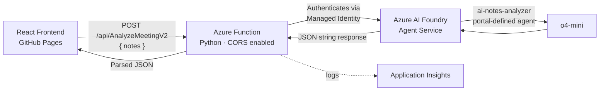

# 🧩 Meeting Notes Analyzer — Backend (Use Case 5)

> A lightweight Azure Function that wraps a portal-defined Azure AI Foundry Agent, exposing it as a public HTTP API for a React frontend to consume.

Built as an extension of Week 3's agentic AI work — this version compares a **portal-managed Foundry Agent** approach against the code-first Microsoft Agent Framework approach used in the original Meeting Notes Analyzer.

---

## ✨ Features

- 🚀 **Serverless HTTP API** — Azure Functions, Python, Consumption plan
- 🧠 **Portal-defined AI agent** — built and versioned entirely in the Azure AI Foundry portal (no agent logic in code)
- 📋 **Strict structured output** — locked-in JSON schema (`summary`, `action_items`, `risks_and_blockers`) enforced via detailed agent instructions with a concrete JSON template
- 🛡️ **Prompt-injection resistant** — agent instructions explicitly reject attempts to override the output format from within the input text
- 🌐 **CORS-enabled** — callable directly from a browser-based frontend on a different domain
- 🔐 **Keyless authentication** — Managed Identity, no API keys stored anywhere
- 🧍 **Stateless by design** — each request is independent; no conversation memory, matching the one-shot nature of this use case

---

## 🏗️ Architecture



| Layer | Technology |
|---|---|
| **Compute** | Azure Functions (Consumption plan, Python 3.13, Linux) |
| **AI Agent** | Azure AI Foundry Agent Service — `ai-notes-analyzer` (portal-defined, `o4-mini`) |
| **SDK** | `azure-ai-projects`, `azure-identity` |
| **Auth** | System-assigned Managed Identity → `Cognitive Services User` role |
| **Monitoring** | Application Insights |

---

## 📡 API Reference

### `POST /api/AnalyzeMeetingV2`

#### Request Body

| Field | Type | Required | Description |
|---|---|---|---|
| `notes` | `string` | ✅ Yes | Raw meeting notes text |

#### ✅ Success Response — `200 OK`

```json
{
  "summary": "Sprint goals reviewed; an API bug needs fixing and testing is blocked by the outdated QA environment.",
  "action_items": [
    { "description": "Fix the API bug", "owner": "Rahul", "due_date": "Friday" }
  ],
  "risks_and_blockers": [
    { "type": "Blocker", "description": "QA environment is outdated, blocking testing" }
  ]
}
```

#### ⚠️ Error Responses

```json
{ "error": "Request body must be valid JSON." }
```
```json
{ "error": "Please provide a 'notes' field." }
```
```json
{ "error": "The agent returned an unexpected format." }
```
```json
{ "error": "Something went wrong while analyzing the meeting notes." }
```

---

## 🧠 Key Implementation Decisions

- **Portal-managed agent, not code-defined** — unlike the original Meeting Notes Analyzer (Microsoft Agent Framework, code-first), this version defines the agent entirely in the Azure AI Foundry portal. This makes the agent's behavior editable without redeploying code, at the cost of losing compile-time schema guarantees.
- **JSON schema enforced via explicit instructions, not native structured output** — since portal agents don't offer a Pydantic-style enforced `response_format`, the schema is instead locked in by giving the agent instructions a literal JSON template to copy, explicit field-name rules, and default values for missing data (e.g. `"Unassigned"`, `"Not specified"`). This was arrived at after observing the agent initially drift between different JSON shapes across responses.
- **Prompt-injection guardrail** — the agent's instructions explicitly state it must ignore any request within the input text asking it to deviate from the JSON structure (e.g. "just give me the action items"), since this input will come from a public-facing frontend.
- **No sessions / stateless design** — this use case is a one-shot "analyze these notes" task with no natural follow-up conversation, so session/context management was deliberately omitted to keep the implementation simple and avoid unnecessary complexity.
- **CORS explicitly enabled** — since the frontend (GitHub Pages) and backend (Azure) run on different domains, the function returns `Access-Control-Allow-Origin: *` on every response, and explicitly handles preflight `OPTIONS` requests.
- **Keyless authentication via Managed Identity** — consistent with all other services in this project; no API key stored anywhere.

---

## 🖥️ Running Locally

```bash
python -m venv .venv
.venv\Scripts\activate
pip install -r requirements.txt
az login
func start
```

Test:
```powershell
Invoke-RestMethod -Uri "http://localhost:7071/api/AnalyzeMeetingV2" `
  -Method Post -ContentType "application/json" `
  -Body '{"notes": "Priya reviewed sprint goals. Rahul needs to fix the API bug by Friday."}'
```

---

## ☁️ Deployment

```bash
func azure functionapp publish <your-function-app-name>
```

**One-time cloud setup:**
1. Enabled System-assigned Managed Identity on the Function App
2. Granted it the `Cognitive Services User` role on the Foundry resource

> 🔐 The live endpoint URL is intentionally not published here to prevent unauthorized use.

---

## 📚 Comparison: This vs. the Original Meeting Notes Analyzer

| | Original (MAF, code-first) | This version (Foundry portal agent) |
|---|---|---|
| Agent defined in | Python code | Foundry portal UI |
| Structured output | Enforced via Pydantic `response_format` | Enforced via detailed prompt instructions only |
| Schema reliability | Guaranteed by the API | Requires careful prompt engineering; verified via testing |
| Editable without redeploying code | ❌ No | ✅ Yes |
| Best suited for | Complex logic, tools, multi-agent orchestration | Simpler agents, fast iteration, non-developers editing behavior |

---

<p align="center"><i>Built with 🐍 Python, ☁️ Azure Functions, and 🤖 Azure AI Foundry Agent Service</i></p>